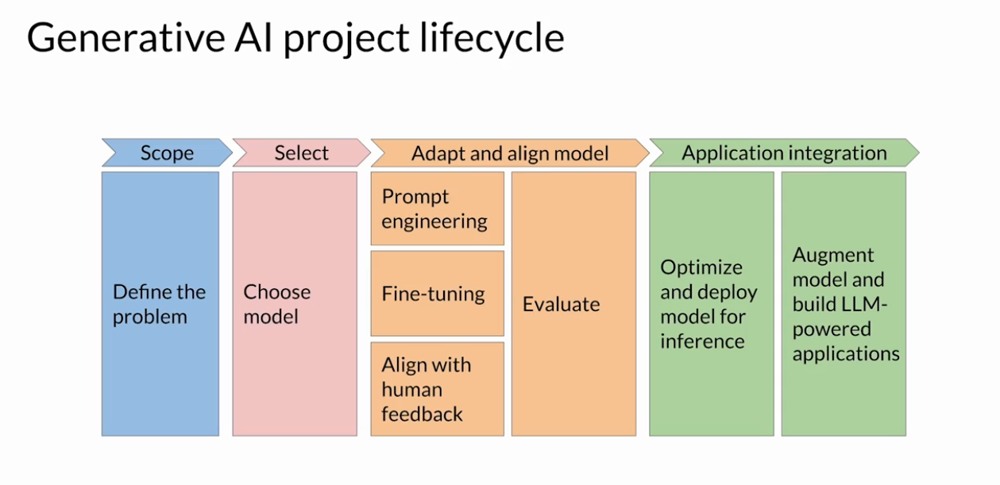
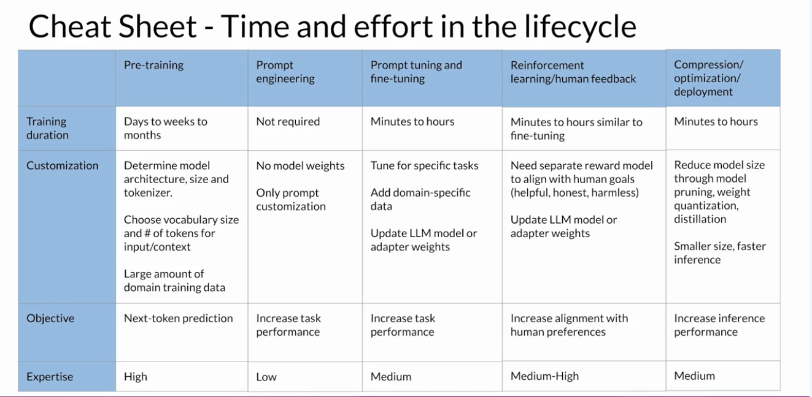
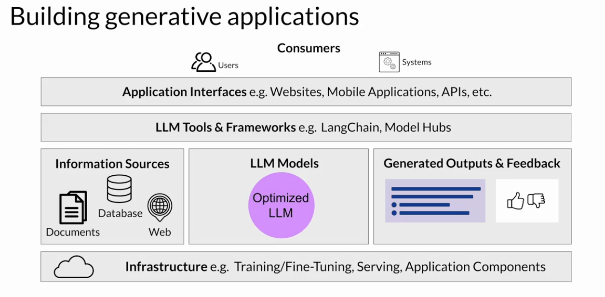

# Generative AI with LLMs

## Overview

This document covers fundamental concepts of Large Language Models (LLMs) and transformer architecture.

## Transformers Architecture

### Key Paper
- **[Attention is All You Need](https://arxiv.org/abs/1706.03762)** - The foundational paper introducing the Transformer architecture

### Components

#### Encoder
- Encodes input prompts with contextual understanding
- Produces one vector per input token
- Captures semantic meaning and relationships between tokens

#### Decoder
- Accepts input tokens to start generation
- Generates new tokens sequentially
- Produces the output text one token at a time

## Key Concepts

- **Attention Mechanism**: Allows the model to focus on relevant parts of the input when processing each token
- **Tokenization**: Breaking down text into tokens (subword units)
- **Contextual Understanding**: Ability to understand meaning based on surrounding context

## Fine-Tuning

### What is Fine-Tuning?
Fine-tuning involves providing many examples of input prompts paired with desired completions—significantly more than few-shot strategies. This approach adapts a pre-trained model to specific use cases.

### Challenges

#### Catastrophic Forgetting
Fine-tuning on a single task can cause the model to lose performance on other tasks it previously understood well.

**Impact**: While fine-tuning can significantly increase performance on a specific task, it may reduce the model's ability to perform well on other tasks.

### Solutions to Avoid Catastrophic Forgetting

> **Note**: You might not need to implement these if single-task performance is your goal.

1. **Multi-task Fine-tuning**: Train on multiple tasks simultaneously to maintain broader capabilities
2. **Parameter Efficient Fine-tuning (PEFT)**: Update only a small subset of parameters instead of the entire model

### Parameter Efficient Fine-tuning (PEFT)

Parameter Efficient Fine-tuning maintains the original model weights while training only a small set of new parameters.

#### LoRA (Low Rank Adaptation)
- Freezes most of the original LLM weights
- Injects 2 rank decomposition matrices alongside the original weights
- Trains only the weights of the smaller matrices
- Highly efficient in terms of parameters and memory

#### Prompt Tuning
- Adds trainable "soft prompts" to the input
- Keeps all model weights frozen
- Optimizes the prompt embeddings during training

## Reinforcement Learning from Human Feedback (RLHF)

- RLHF is a technique for aligning model outputs with human preferences using reinforcement learning.
- Models may attempt **reward hacking** to achieve high scores by exploiting shortcuts rather than solving the intended task.
- A **KL divergence penalty** is often added to the reward function to keep the fine-tuned policy close to the original model distribution.

## Generative AI Project Lifecycle

*Illustrative diagram of steps in a generative AI project.*

## LLM Optimization Techniques

- **Distillation** – train a smaller "student" model to mimic a larger "teacher" model.
- **Quantization (PTQ)** – reduce the precision of model weights (e.g. 16-bit → 8-bit) to save memory and speed up inference.
- **Pruning** – remove weights with values close to zero to sparsify the model and improve efficiency.

*Visual overview of optimization strategies.*

## Retrieval-Augmented Generation (RAG)

- Connects an LLM to external datasets or applications to augment its knowledge at inference time.
- Enables up-to-date, factual responses by retrieving relevant documents and conditioning generation on them.

## ReAct: Reasoning and Action in LLMs

ReAct is a prompting strategy that combines **chain-of-thought reasoning** with **action planning**:

1. The model alternates between reasoning steps (thinking) and action steps (interacting with tools or APIs).
2. Actions are selected from a limited set defined by instructions prepended to the prompt.

This approach helps models solve tasks that require both internal reasoning and external interactions.

*Example flowchart of the ReAct strategy.*
